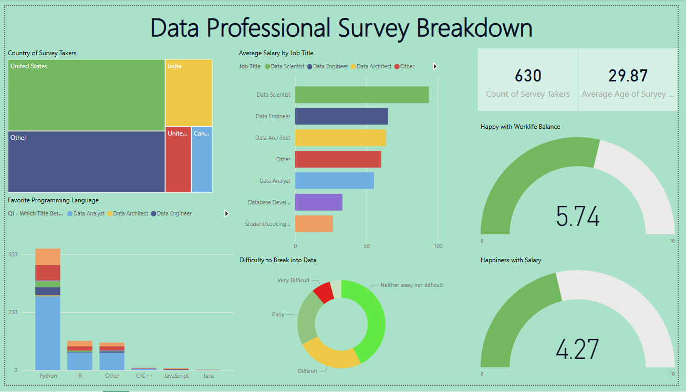

# 📊 Data Professional Survey Analysis

This Power BI project analyses data from a survey of data professionals to explore trends in salary, job roles, technologies, and work habits. It provides visual insights into how different factors, such as country, experience, and tools, impact compensation and professional experience.

---

## 📁 Project Structure
Data Professional Survey Analysis/
├── Power BI project.pbix
├── Data Professional Survey.csv
├── README.md
├── dashboard.png

---

## 🎯 Objective

**The goal of this analysis is to**:
- Understand the salary distribution by job role and country.
- Identify commonly used programming languages and tools.
- Examine the effect of work hours, experience, and geography on compensation.
- Provide a visual dashboard for easy data exploration.

---

## 📂 Dataset

- **File**: `Data Professional Survey.csv`
- **Format**: CSV
- **Columns**:
  - `Unique ID`
  - `Email`
  - `Title`
  - `Industry`
  - `Current Position`
  - `Current Age`
  - `Country`
  - `Education`

---

### 🧮 Dashboard Overview

- The Power BI report includes filters by job title, industry, country, and education.
- Interactive visuals help in slicing data across multiple dimensions.

---

## 🛠️ Tools Used

- **Power BI Desktop**
- **CSV Dataset**
- **GitHub** (for version control and project sharing)

---

## 🚀 How to View This Project

1. Clone the repository or download the project files.
2. Open `Power BI project.pbix` in [Power BI Desktop](https://powerbi.microsoft.com/desktop/).
3. Explore the visuals, filters, and pages in the report.

---
